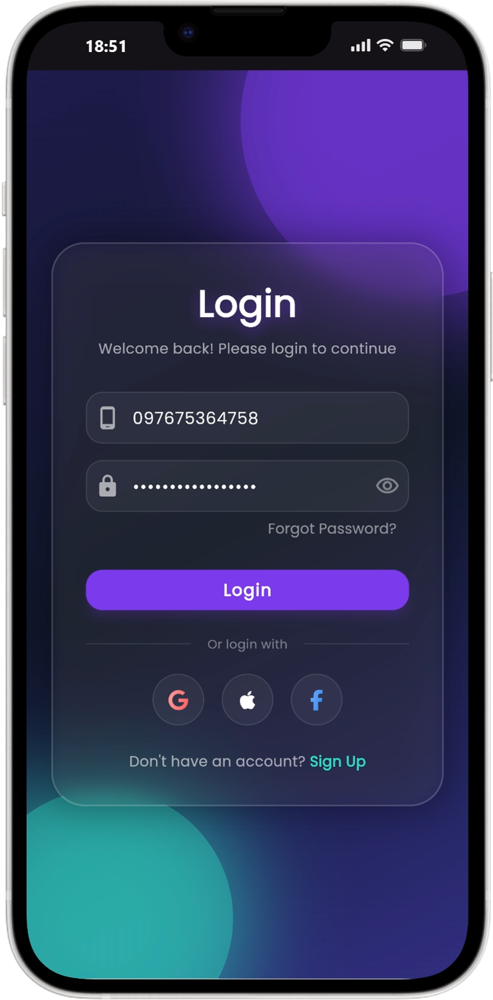
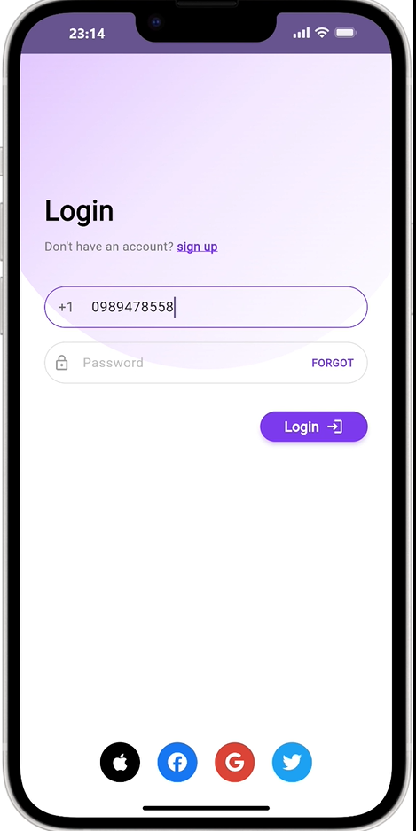

# Animated Login Screen 🎨

A beautiful, modern Flutter login screen featuring a gradient background, smooth animations, and social login integration.


## 📸 Screenshots

<p align="center">
  
  &nbsp;&nbsp;&nbsp;&nbsp;
  
</p>

## ✨ Features

- **Elegant Gradient Background** - Soft purple gradient circle creating a premium aesthetic
- **Modern Input Fields** - Rounded text fields with focus states and custom styling
- **Social Login Integration** - Apple, Facebook, Google, and Twitter login options
- **Responsive Design** - Adapts to different screen sizes
- **Material 3 Design** - Follows latest Material Design guidelines
- **Clean Code** - Well-organized, maintainable codebase

## 🎯 UI Components

- **Phone Number Field** - With +1 country code prefix
- **Password Field** - Lock icon with "FORGOT" password link
- **Login Button** - Purple pill-shaped button with icon
- **Social Icons** - Four circular brand icons at the bottom
- **Interactive Elements** - Tap gestures for sign up and forgot password

## 🚀 Getting Started

### Prerequisites

- Flutter SDK (3.10.7 or higher)
- Dart SDK
- An IDE (VS Code, Android Studio, or IntelliJ)

### Installation

1. Clone the repository:
```bash
git clone https://github.com/Anniekarim29/AnimatedLoginScreen.git
cd AnimatedLoginScreen
```

2. Install dependencies:
```bash
flutter pub get
```

3. Run the app:
```bash
# On Chrome
flutter run -d chrome

# On Android/iOS
flutter run
```

## 📦 Dependencies

```yaml
dependencies:
  flutter:
    sdk: flutter
  cupertino_icons: ^1.0.8
  font_awesome_flutter: ^10.12.0
```

## 🎨 Color Scheme

- **Primary Purple**: `#7C3AED`
- **Light Purple**: `#D8B4FE`
- **Very Light Lavender**: `#F3E8FF`
- **Background**: White
- **Text**: Black & Grey shades

## 📱 Supported Platforms

- ✅ Android
- ✅ iOS
- ✅ Web
- ✅ Windows (requires Visual Studio)
- ✅ macOS
- ✅ Linux

## 🏗️ Project Structure

```
lib/
├── main.dart           # App entry point
└── login_screen.dart   # Login UI implementation
```

## 🤝 Contributing

Contributions are welcome! Feel free to open issues or submit pull requests.

## 📄 License

This project is open source and available under the [MIT License](LICENSE).

## 👤 Author

**Annie Karim**
- GitHub: [@Anniekarim29](https://github.com/Anniekarim29)

## 🌟 Show Your Support

Give a ⭐️ if you like this project!
